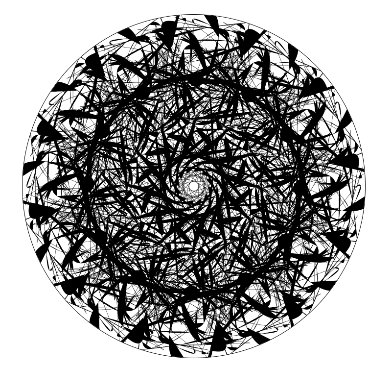

# Mandala Maker
[Live Version](https://younis-hamalawy.github.io/mandala_mania/)

Mandala Mania is drawing app. It utilizes rotational symmetry to multiply anything the user draws a number of times. Mandala Mania lets the user create a masterpiece in seconds, humans love symmetry. Mandala Mania was built utilizing JavaScript and the EaselJS library from CreateJS to manipulate the HTML5 Canvas element.

## Features

* Rainbow cycling brush
* Control the number of axes
* Control the size of the line
* Choose a color from a full color palette

## Technologies Used

* HTML5 Canvas
* JavaScript for drawing logic
* [EaselJS](http://www.createjs.com/easeljs) to further manipulate the drawing area

## Feature Highlights

To allow the creation of multiple lines at a time, coordinates are captured whenever the user holds the mouse down and multile points are created at the same time at various coordinates with intervals equal to the number of axis chosen.

With every click on the draw area, the color cycles automatically through a 15 color array until the user chooses a color manually.



#### Sample from draw_pad.js

```javascript
 MouseDown(event) {
  if (!event.primary) {
    return;
  }

  const { x: mouseX, y: mouseY } = this.getPos(event);
  if (this.clickCount === this.colors.length) {
    this.clickCount = 0;
  }
  this.clickCount++;
  if (this.color === this.colors[this.clickCount - 1]) {
    this.color = this.colors[this.index++ % this.colors.length];
  }

  this.oldPt = new createjs.Point(mouseX, mouseY);
  this.oldMidPt = this.oldPt.clone();

  for (let i = 1; i < this.axes + 1; i++) {
    const { x: x1, y: y1 } = this.rotate(mouseX, mouseY, i, this.axes);
    this.drawArea.graphics
      .setStrokeStyle(this.stroke, 'round', 'round')
      .beginStroke(this.color)
      .beginFill(this.color)
      .drawCircle(x1, y1, this.stroke >> 1);
  }

  this.stage.addEventListener('stagemousemove', this.MouseMove);
  this.stage.update();
}
```


## Future Plans

### Save/ Print your drawing
Allow the user to save to desk or print their image.

### Set background image to the drawing area
Allow the user to drag and drop a Ganesha background to be the center of their mandala

##### DISCLAIMER: This project was built with the help of the logic posted on https://github.com/ayyjohn/mandalamaker