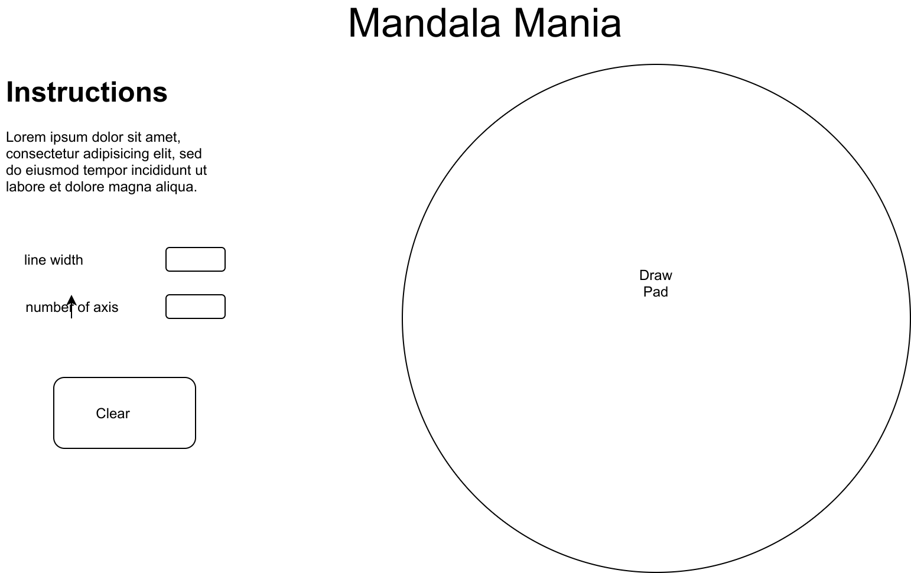

# Mandala Maker

## Background
The word Mandala (pronunciation mon- dah- lah) means "circle".  A Mandala represents wholeness, a cosmic diagram reminding us of our relation to infinity, extending beyond and within our bodies and minds. The mandala appears to us in all aspects of life, the Earth, the Sun, the Moon and more obviously the circles of life encompassing friends, family and communities. Mandalas are circular designs symbolizing the notion that life is never ending.

Merriam-Webster:

  mandala
  noun  man·da·la \ˈmən-də-lə\

  1: a Hindu or Buddhist graphic symbol of the universe; specifically :  a circle enclosing a square with a deity on each side that is used chiefly as an aid to meditation
  2: a graphic and often symbolic pattern usually in the form of a circle divided into four separate sections or bearing a multiple projection of an image

## Functionality and MVP

With this Mandala Mania, users will be able to:

- [ ] Create a Mandala using mouse/touchpad.
- [ ] Choose the number of axis
- [ ] Clear the canvas

In addition this project will include
- [ ] An instructional section on the page describing the background and how to
- [ ] A production README

## Wireframe



Mandala Mania will consist of a single screen with a large draw pad and interactive controls. The user will be able to enter the number of rotations. A clear bitton to reset the draw pad. Nav links to the Github, my LinkedIn, Instructions and background area.

## Architecture and Technologies

This project will be implemented using the following:
- Vanilla Javascript (ES2015) for overall structure and interactivity.
- ```Easel.js``` with html5's ```<canvas>``` for DOM manipulation and rendering
- Webpack to bundle and serve up the various scripts.

## Implementation Timeline

### Day 1
  Setup all necessary Node modules, including getting webpack up and running and Easel.js installed. Create webpack.config.js as well as package.json. Write a basic entry file and the bare bones of all 3 scripts outlined above. Learn the basics of Easel.js. Goals for the day:

 - Get a green bundle with webpack
 - Learn enough Easel.js to render an object to the Canvas element

### Day 2
  Dedicate this day to learning the Easel.js API.

 - Draw one the axis and be able to draw at 2 positions at once
 - Add button to clear canvas instead of refreshing

### Day 3
  Dedicate this day to the core functianality.

 - Implement drawing multiple lines at the same time for more than one axis
 - Implement the change of the drawing color

### Day 4
  Dedicate this day to polish and add functionality buttons.

  - Add buttons changing line color
  - Add an instructional section
  - Style the page

Bonus/Future Features
- [ ] Allow the user to change what color they're drawing with by selecting a check box
- [ ] Allow the user to change what size of cursor they're drawing with
- [ ] Automatic rainbow color change of the cursor
- [ ] Save - Print your drawing
- [ ] Drag a Ganesha from a side panel on top of your image
